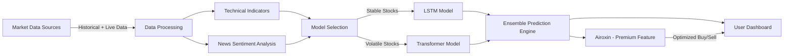

# 📈 Stockgorithm – AI-Powered Virtual Finance Manager

**Stockgorithm** is an **AI-driven virtual finance manager** that analyzes market liquidity, volatility, technical indicators, and real-time news sentiment to help investors make data-driven trading decisions.
It combines **Transformer** and **LSTM** models, an **ensemble prediction engine**, and a premium feature **Airoxin** for hands-free intraday trading assistance.

---

## 🚀 Features

* **Dynamic Model Selection**
  Uses Transformer models for highly volatile stocks and LSTM models for stable ones.
* **End-of-Day Stock Selection**
  Picks the top 4 stocks based on liquidity changes.
* **Technical Indicator Analysis**
  Computes RSI, MACD, Pivot Points, Bollinger Bands, Volume Trends, etc.
* **News Sentiment Integration**
  Real-time sentiment scoring from market news.
* **Ensemble Prediction Engine**
  Combines multiple model predictions for accuracy.
* **Live Market Adaptation**
  Models run and adjust in real-time during market hours.
* **Premium Feature – Airoxin**

  * Monitors user holdings
  * Suggests optimized buy/sell actions
  * Finds better-performing alternatives
  * Learns and adapts like an experienced trader
* **Frontend Dashboard**
  Interactive React-based UI for stock monitoring, news feed, and analytics.

---

## 📂 Project Structure

```
Stockgorithm/
│
├── Backend/
│   ├── main.py              # Main backend application entry point
│   ├── data/                # Historical and live market data storage
│   ├── models/              # Trained AI models (LSTM, Transformer)
│   ├── utils/               # Helper scripts for indicators, sentiment, etc.
│   ├── requirements.txt     # Python dependencies
│
├── Frontend/
│   ├── public/              # Static assets
│   ├── src/                 # React components and pages
│   ├── package.json         # Node.js dependencies
│
├── README.md                # Project documentation
└── LICENSE                  # License file
```

---

## ⚙️ Installation & Setup

### 1️⃣ Backend Setup (Python)

**Prerequisites:**

* Python 3.9+
* pip
* Virtual environment (recommended)

```bash
# Clone the repository
git clone https://github.com/yourusername/Stockgorithm.git
cd Stockgorithm/Backend

# Create a virtual environment
python -m venv venv
source venv/bin/activate   # For Linux/Mac
venv\Scripts\activate      # For Windows

# Install dependencies
pip install -r requirements.txt

# Run the backend
python main.py
```

By default, the backend runs on **[http://localhost:5000](http://localhost:5000)**.

---

### 2️⃣ Frontend Setup (React)

**Prerequisites:**

* Node.js 18+
* npm or yarn

```bash
cd Stockgorithm/Frontend

# Install dependencies
npm install   # or yarn install

# Start the development server
npm start     # or yarn start
```

Frontend runs on **[http://localhost:3000](http://localhost:3000)** by default.

---

## 📊 How It Works

1. **Daily Stock Selection**
   End-of-day liquidity changes are analyzed to select the top 4 stocks for the next session.

2. **Model Selection**

   * Transformer for volatile stocks
   * LSTM for stable stocks

3. **Data Processing**

   * Fetch months of intraday data
   * Calculate technical indicators
   * Perform real-time news sentiment analysis

4. **Model Training & Deployment**

   * Train models daily before market opens
   * Deploy for live predictions

5. **Live Prediction & Recommendations**

   * Ensemble engine merges predictions
   * Users receive real-time buy/sell insights
   * Premium users can activate Airoxin for automated recommendations

---

## 🖥️ Tech Stack

**Backend:**

* Python
* Flask / FastAPI
* pandas, NumPy
* scikit-learn, TensorFlow / PyTorch
* yfinance (for stock data)
* BeautifulSoup / Selenium (for web scraping)

**Frontend:**

* React.js
* Tailwind CSS / Material UI
* Chart.js / D3.js
* Axios (API calls)

**AI Models:**

* Transformer networks
* LSTM (Long Short-Term Memory networks)
* Sentiment analysis (NLP models)

---

## 🤝 Team & Contributions

* **Augustine Vincent** – Web Scraping & Data Collection Pipelines
* **Albin Binu** – Logo Design, UI/UX Development
* **Abin A C** – Frontend Development, News Sentiment Analysis, AI Insight Generation, Database Management
* **Aswin Asokan** – AI Agent Development, Data Acquisition, Feature Engineering, AI Model Training, Stock Research, Backend & Server-Side Database Development

---

## 📅 Future Enhancements

* Reinforcement Learning for portfolio optimization
* Full broker API integration for auto-trading
* Risk-adjusted personalized recommendations
* Social sentiment analysis from Twitter, Reddit, etc.

---

## 📜 License

This project is licensed under the **MIT License**.

---

## 📬 Contact

For collaboration, suggestions, or queries, feel free to reach out on **LinkedIn** or open an issue in this repository.

---

## 🔍 Data Flow Diagram (Mermaid)


